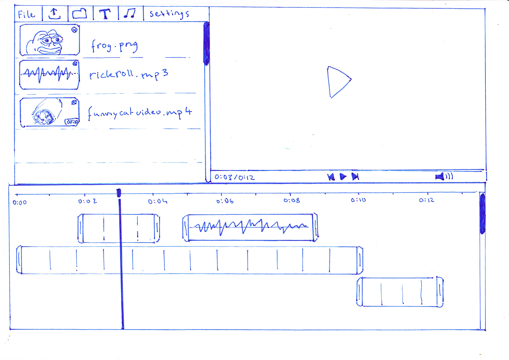
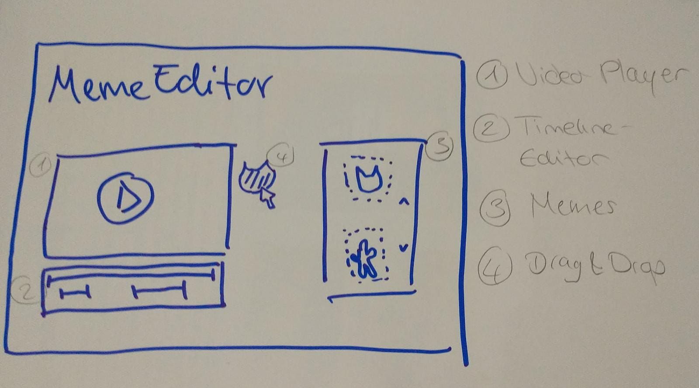

<h1>Welcome to Meme Editor!</h1>

This is a project we made for the class Audio- und Videotechnik (Audio and video technology) at HTW Berlin (Berlin University of Applied Sciences for Engineering and Economics).

<h3>Idea</h3>
For our class, we wanted to create a web app that allows a user to add memes to a video. It’s a quick browser-based editor that already provides the memes, so you don’t have to search them. Just open and play around :)

<h3>Prototypes</h2>

Prior to starting development of our digital prototype, we created multiple paper prototypes that match our idea.
They all included a video component, a timeline editor, and a set of memes to choose from. Here you can see one of our prototypes.

In the end of our paper prototyping, we decided on a more minimalistic approach so users can use the main features intuitively. In regard to UX, we also moved the video player to the left, as studies have shown dragging from right to left is more convenient for users[^1].

As you will see in our digital prototype, some changes were made to this also.

Since these are prototypes, there are many possibilities to improve and scale up. As of now, we only added one track line to manage added GIFs. In a bigger project, more track lines can be added to also include audio memes and video memes.

-----

<h3>Tech Stack</h3>
Our app was created with React.js, CSS3 and HTML5.

The timeline below the video player was made using the visjs-timeline library, which is a dynamic, browser based visualization library.

Atoms of the recoil library are used to share states between components comfortably.

The React libraries "react-draggable" and "react-resizable" were used to turn the GIFs into draggable objects that the user can also resize. 

----

<h3>Starting the application</h3>

After downloading, prior to starting the app for the first time, run “npm install” in the project directory to install all needed dependencies. Afterwards, the project can be started by running “npm start” in the project directory. When loaded, it will run on local port 3000. If the browser window doesnt pop up automatically, open http://localhost:3000 in your browser.

<h3>Using the application</h3>
Our app is quite straight-forward. 

1. Click the "Upload your video" button and choose a video from your system to upload to the app. If you want to upload a different video, you can choose a new file any time.
2. You can now see your video on screen, as well as the video controls below. The timeline does now match the video length and the video is displayed as the first element on the timeline.
3. In the GIF section to the right, choose a GIF you want to use in your video by clicking on it and dragging it onto the video. When you drop the GIF onto the video at the desired position, it appears as a new element on the timeline. 
4. To change the size of your GIF, hover over its edges while it is still in the container. You will see common resizing icons that let you change height, width or both. You can also adjust the position of the GIF on the video anytime. 
5. You can now change the timestamp and display time of the GIF by moving it around on the timeline and pulling on the left or right side of the timeline item to change the length in either direction. If you want to remove a GIF, simply click on it - a red "X" will appear and you can delete the item by clicking on it.

<h3>Features</h3>

**Upload video**

Lets the user upload a video from their own device. Since you can't really style input forms, the actual button is hidden behind a label that is styled like a button. 

**Video player**

Player for the video the user has uploaded.
Has a custom play-button and a custom volume control. 

**GIFs**

We provide you with a curated set of GIFs you can use to modify your video.
The GIFs we used are from either giphy.com or tenor.com, which are free-to-use content platforms that specialize on GIFs.

**Drag GIFs onto video**

Drag GIFs from the container onto the video.
There's a canvas behind the video element, so other elements can be dragged and displayed on top of the video while it's played.

**Edit GIFs**

You can resize the GIFs inside the container (height, width or both in relation to original proportion) and drag the resized onto the video. You can also reposition the GIF anytime while it is displayed on screen. 

**Timeline**

The timeline is linked to the video and displays video length and the video itself as default element.
All added GIF elements are added in the next track line. 

**Edit video**

Memes can be moved around on or removed from the timeline to create a video with memes.

---
[^1]: "A cross-cultural and cross-language comparison of drag and drop" by Cai, Y., Guo, Y., and Guo, S. in International Journal of Human-Computer Studies, vol. 84, 2016

