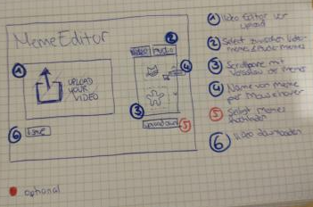

<h1>Welcome to Meme Editor!</h1>

This is a project we made for the class Audio- und Videotechnik (Audio and video technology) at HTW Berlin (Berlin University of Applied Sciences for Engineering and Economics).

<h3>Idea</h2>
For our class, we wanted to create a web app that allows a user to add memes to a video. It’s a quick browser-based editor that already provides the memes, so you don’t have to search them. Just open and play around :)

-----

<h3>Tech Stack</h3>
Our app was created with React.js, CSS3 and HTML5.

The timeline below the video player was made using the visjs-timeline library, which is a dynamic, browser based visualization library.

Atoms of the recoil library are used to share states between components comfortably.

The React libraries "react-draggable" and "react-resizable" were used to turn the GIFs into draggable objects that the user can also resize. 

----

<h3>Starting the application</h3>

After downloading, prior to starting the app for the first time, run “npm install” in the project directory to install all needed dependencies. Afterwards, the project can be started by running “npm start” in the project directory. When loaded, it will run on local port 3000. If the browser window doesnt pop up automatically, open http://localhost:3000 in your browser.

<h3>Using the application</h3>
Our app is quite straight-forward. 

1. Click the "Upload your video" button and choose a video from your system to upload to the app. If you want to upload a different video, you can choose a new file any time.
2. You can now see your video on screen, as well as the video controls below. The timeline does now match the video length and the video is displayed as the first element on the timeline.
3. In the GIF section to the right, choose a GIF you want to use in your video by clicking on it and dragging it onto the video. When you drop the GIF onto the video, it appears as a new element on the timeline. 
4. You can now edit the position by dragging the GIF around, resize it by ??????? and modify the start and end of the GIF by dragging the element on the timeline or resizing it xxxxxxxx You can remove a GIF by clicking on the element and then clicking on the red x that appears.

<h3>Features</h3>

**Upload video**

Lets the user upload a video from their own device. Since you can't really style input forms, the actual button is hidden behind a label that is styled like a button. Changes after first upload :)

**Video player**

Player for the video the user has uploaded.
Has a custom play-button and a custom volume control. 

**Drag GIFs onto video**

Drag gifs from the container onto the video.
There's a canvas behind the video element, so other elements can be dragged and displayed on top of the video while it's played.
The GIFs we used are from either giphy.com or tenor.com, which are free-to-use content platforms that specialize on GIFs.

**Edit GIFs**

resize and reposition

**Timeline**

The timeline is linked to the video and displays video length and the video itself as default element.
All added GIF elements are added in the next line. 

**Edit video**

Memes can be moved on or removed from the timeline to create a video with memes.

---

<h3>Prototypes</h2>

Prior to starting development of our digital prototype, we created multiple paper prototypes that match our idea. They were all pretty similar – one video component, a timeline editor and a set of memes to choose from. Below the paper prototype our digital prototype is closest to.

//photos paper prototypes

// *will post better pictures later, best way to do it is dropping them in the online editor actually*

Since this is a prototype, there are many possibilities to improve and scale up. As of now, we only added one track line to manage added GIFs. In a bigger project, more track lines can be added to also include audio memes and video memes. 

